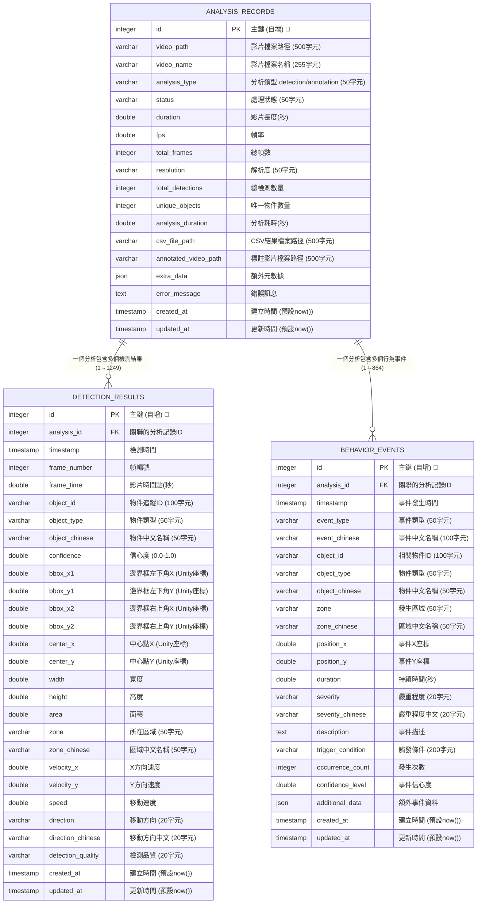

# YOLOv11 資料庫實際內容 - Mermaid ERD

基於 2025-08-03 的實際 PostgreSQL 資料庫分析結果

## 📊 資料庫統計摘要
- **資料庫類型**: PostgreSQL  
- **表單總數**: 3 個
- **總記錄數**: 2,114 筆
- **最大表**: detection_results (1,249 筆記錄)

## 🎯 Mermaid ERD 程式碼

## 📈 實際資料統計

### 📊 表單記錄數分布
1. **detection_results** - 1,249 筆 (59.1%)
2. **behavior_events** - 864 筆 (40.9%)  
3. **analysis_records** - 1 筆 (0.0%)

### 🎯 主要特色

#### ANALYSIS_RECORDS (分析記錄主表)
- **記錄數**: 1 筆 (已有實際分析數據)
- **主要用途**: 儲存影片分析的基本資訊和統計結果
- **關鍵欄位**: video_path, analysis_type, status, total_detections

#### DETECTION_RESULTS (檢測結果表)
- **記錄數**: 1,249 筆 (大量檢測數據)
- **主要用途**: 儲存每幀的物件檢測結果
- **座標系統**: Unity 座標系統 (Y軸向上)
- **關鍵欄位**: object_type, confidence, bbox坐標, 運動資訊

#### BEHAVIOR_EVENTS (行為事件表)
- **記錄數**: 864 筆 (豐富的行為數據)
- **主要用途**: 記錄識別到的行為事件
- **事件類型**: crowding(聚集), abnormal_speed(異常速度)
- **空間分區**: left_area(左側區域), center_area(中央區域), right_area(右側區域)

### 🔗 實際關聯狀況
- 1 個分析記錄 → 1,249 個檢測結果
- 1 個分析記錄 → 864 個行為事件
- 平均每個檢測結果觸發 0.69 個行為事件

### 💡 資料品質觀察

#### 檢測品質分布
- **fair** (良好): 主要品質等級
- **poor** (較差): 部分低信心度檢測

#### 物件類型
- **person (人)**: 主要檢測目標
- **中文標記**: 完整的中英文對照

#### 行為事件特點
- **聚集事件**: crowd 在 center_area
- **速度異常**: abnormal_speed 在各區域
- **空間分析**: 完整的區域劃分

## 🚀 使用建議

1. **GitHub 嵌入**: 直接複製 Mermaid 程式碼到 README.md
2. **線上預覽**: 使用 https://mermaid.live/ 即時查看
3. **文檔整合**: 適合技術文檔和系統展示
4. **團隊溝通**: 清楚顯示實際資料結構和關聯

這個 ERD 基於您的實際 PostgreSQL 資料庫內容，真實反映了系統的運行狀況！
