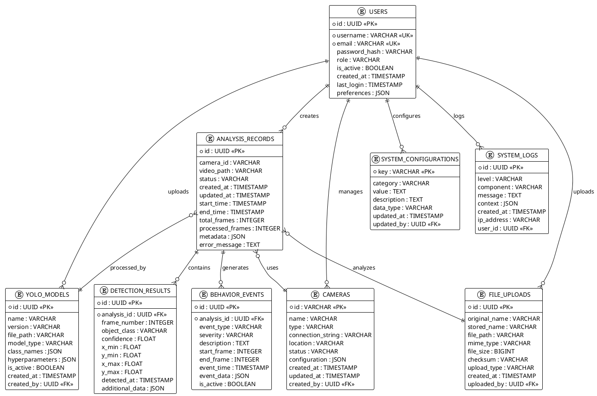

# YOLOv11 數位雙生分析系統 - PlantUML ERD



## 🎨 PlantUML 使用說明

### 線上工具
- PlantUML Online: http://www.plantuml.com/plantuml/
- 複製上面的 PlantUML 代碼貼上即可生成圖表

### 本地工具
```bash
# 安裝 PlantUML
npm install -g node-plantuml
# 或使用 Java 版本
java -jar plantuml.jar diagram.puml
```

### VS Code 擴展
- PlantUML: 支援即時預覽
- Markdown Preview Enhanced: 支援 PlantUML 渲染
