# YOLOv11 數位雙生分析系統 - 資料庫 ERD

```mermaid
erDiagram
    %% === 核心分析表 ===
    
    ANALYSIS_RECORDS {
        uuid id PK "主鍵 (UUID)"
        varchar camera_id "攝影機 ID"
        varchar video_path "影片檔案路徑"
        varchar status "處理狀態 (pending/processing/completed/failed)"
        timestamp created_at "建立時間"
        timestamp updated_at "更新時間"
        timestamp start_time "分析開始時間"
        timestamp end_time "分析結束時間"
        integer total_frames "總幀數"
        integer processed_frames "已處理幀數"
        json metadata "額外資訊 (JSON)"
        text error_message "錯誤訊息"
    }
    
    DETECTION_RESULTS {
        uuid id PK "主鍵 (UUID)"
        uuid analysis_id FK "分析記錄 ID"
        integer frame_number "幀編號"
        varchar object_class "物件類別"
        float confidence "信心度 (0-1)"
        float x_min "邊界框左上角 X"
        float y_min "邊界框左上角 Y"
        float x_max "邊界框右下角 X"
        float y_max "邊界框右下角 Y"
        timestamp detected_at "檢測時間"
        json additional_data "額外檢測資訊 (JSON)"
    }
    
    BEHAVIOR_EVENTS {
        uuid id PK "主鍵 (UUID)"
        uuid analysis_id FK "分析記錄 ID"
        varchar event_type "事件類型"
        varchar severity "嚴重等級 (low/medium/high/critical)"
        text description "事件描述"
        integer start_frame "開始幀"
        integer end_frame "結束幀"
        timestamp event_time "事件時間"
        json event_data "事件詳細資料 (JSON)"
        boolean is_active "是否活躍狀態"
    }
    
    %% === 系統管理表 (建議新增) ===
    
    USERS {
        uuid id PK "主鍵 (UUID)"
        varchar username UK "使用者名稱 (唯一)"
        varchar email UK "電子郵件 (唯一)"
        varchar password_hash "密碼雜湊"
        varchar role "角色 (admin/operator/viewer)"
        boolean is_active "是否啟用"
        timestamp created_at "建立時間"
        timestamp last_login "最後登入時間"
        json preferences "使用者偏好設定 (JSON)"
    }
    
    CAMERAS {
        varchar id PK "攝影機 ID"
        varchar name "攝影機名稱"
        varchar type "類型 (webcam/ipcam/file)"
        varchar connection_string "連接字串"
        varchar location "安裝位置"
        varchar status "狀態 (active/inactive/error)"
        json configuration "配置參數 (JSON)"
        timestamp created_at "建立時間"
        timestamp updated_at "更新時間"
        uuid created_by FK "建立者 ID"
    }
    
    YOLO_MODELS {
        uuid id PK "主鍵 (UUID)"
        varchar name "模型名稱"
        varchar version "版本號"
        varchar file_path "模型檔案路徑"
        varchar model_type "模型類型 (detection/segmentation/classification)"
        json class_names "類別名稱列表 (JSON)"
        json hyperparameters "超參數 (JSON)"
        boolean is_active "是否啟用"
        timestamp created_at "建立時間"
        uuid created_by FK "建立者 ID"
    }
    
    SYSTEM_CONFIGURATIONS {
        varchar key PK "配置鍵"
        varchar category "配置類別"
        text value "配置值"
        text description "描述"
        varchar data_type "資料類型"
        timestamp updated_at "更新時間"
        uuid updated_by FK "更新者 ID"
    }
    
    SYSTEM_LOGS {
        uuid id PK "主鍵 (UUID)"
        varchar level "日誌等級 (debug/info/warning/error/critical)"
        varchar component "元件名稱"
        text message "日誌訊息"
        json context "上下文資訊 (JSON)"
        timestamp created_at "建立時間"
        varchar ip_address "IP 位址"
        uuid user_id FK "使用者 ID"
    }
    
    FILE_UPLOADS {
        uuid id PK "主鍵 (UUID)"
        varchar original_name "原始檔名"
        varchar stored_name "儲存檔名"
        varchar file_path "檔案路徑"
        varchar mime_type "MIME 類型"
        bigint file_size "檔案大小 (bytes)"
        varchar checksum "檔案雜湊"
        varchar upload_type "上傳類型 (video/image/model/config)"
        timestamp created_at "上傳時間"
        uuid uploaded_by FK "上傳者 ID"
    }
    
    %% === 關聯關係 ===
    
    %% 一對多關係
    ANALYSIS_RECORDS ||--o{ DETECTION_RESULTS : "一個分析包含多個檢測結果"
    ANALYSIS_RECORDS ||--o{ BEHAVIOR_EVENTS : "一個分析包含多個行為事件"
    USERS ||--o{ ANALYSIS_RECORDS : "使用者建立分析記錄"
    USERS ||--o{ CAMERAS : "使用者管理攝影機"
    USERS ||--o{ YOLO_MODELS : "使用者上傳模型"
    USERS ||--o{ SYSTEM_LOGS : "使用者操作日誌"
    USERS ||--o{ FILE_UPLOADS : "使用者上傳檔案"
    USERS ||--o{ SYSTEM_CONFIGURATIONS : "使用者修改配置"
    
    %% 多對一關係
    ANALYSIS_RECORDS }o--|| CAMERAS : "分析記錄對應攝影機"
    ANALYSIS_RECORDS }o--|| YOLO_MODELS : "分析記錄使用模型"
    ANALYSIS_RECORDS }o--|| FILE_UPLOADS : "分析記錄對應上傳檔案"
```



## 📊 資料庫結構說明

### 🎯 核心業務表

1. **ANALYSIS_RECORDS** - 分析記錄表
   - 儲存每次影片分析的基本資訊
   - 追蹤處理狀態和進度
   - 記錄分析時間和結果統計

2. **DETECTION_RESULTS** - 檢測結果表
   - 儲存 YOLO 模型的檢測結果
   - 包含物件位置、類別和信心度
   - 支援大量檢測資料的高效查詢

3. **BEHAVIOR_EVENTS** - 行為事件表
   - 記錄系統識別的行為事件
   - 支援事件嚴重等級分類
   - 可追蹤事件的時間範圍

### 🛠️ 系統管理表

4. **USERS** - 使用者管理
   - 支援多使用者權限控制
   - 角色基礎的存取控制
   - 使用者偏好設定

5. **CAMERAS** - 攝影機管理
   - 支援多種攝影機類型
   - 動態配置和狀態監控
   - 位置資訊管理

6. **YOLO_MODELS** - 模型管理
   - 版本控制和模型切換
   - 支援不同類型的 YOLO 模型
   - 類別定義和超參數管理

7. **SYSTEM_CONFIGURATIONS** - 系統配置
   - 集中化配置管理
   - 支援動態配置更新
   - 配置變更追蹤

8. **SYSTEM_LOGS** - 系統日誌
   - 全面的操作記錄
   - 多等級日誌支援
   - 問題診斷和審計追蹤

9. **FILE_UPLOADS** - 檔案管理
   - 統一的檔案上傳管理
   - 檔案完整性驗證
   - 支援多種檔案類型

### 🔗 關聯關係

- **一對多關係**: 一個分析記錄包含多個檢測結果和行為事件
- **多對一關係**: 多個分析記錄可以使用同一個攝影機或模型
- **追蹤關係**: 所有重要操作都可追蹤到具體使用者

### 📈 索引策略

```sql
-- 主要查詢索引
CREATE INDEX idx_analysis_records_status ON analysis_records(status);
CREATE INDEX idx_analysis_records_created_at ON analysis_records(created_at);
CREATE INDEX idx_detection_results_analysis_id ON detection_results(analysis_id);
CREATE INDEX idx_detection_results_frame_number ON detection_results(frame_number);
CREATE INDEX idx_behavior_events_analysis_id ON behavior_events(analysis_id);
CREATE INDEX idx_behavior_events_event_type ON behavior_events(event_type);
CREATE INDEX idx_system_logs_created_at ON system_logs(created_at);
CREATE INDEX idx_system_logs_level ON system_logs(level);

-- 複合索引
CREATE INDEX idx_detection_results_analysis_frame ON detection_results(analysis_id, frame_number);
CREATE INDEX idx_behavior_events_analysis_time ON behavior_events(analysis_id, event_time);
```

### 🚀 性能最佳化建議

1. **資料分割**: 按時間範圍分割大表
2. **歸檔策略**: 定期歸檔舊資料
3. **快取策略**: 常用查詢結果快取
4. **批量處理**: 大量檢測結果批量插入

這個 ERD 涵蓋了您目前的核心功能並為未來擴展提供了完整的基礎架構！
